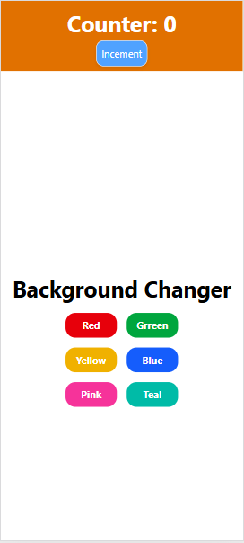

## useEffect
- It execute its callback function at last.
- It has two component callback and dependencies.
- Dependencies refers if that dependencies change only then it will execute call back.

 
-> If dependencies is empty then it run only once
-> If dependencies array are not given then har baar chalega
-> If we have any thing on array then it execute on when variable changes.

React.memo() gives the power to render the component only once. 
If we pass value as props and it is being changing then React.memo executes whole component again and again.

Note: React.memo use only when your child changes frequently. Do not use memo heavily because it increases code overhead. 

Overhead because memo use krte waqt code bhi tou attach hoga.
-> Export the component with React.memo(). 