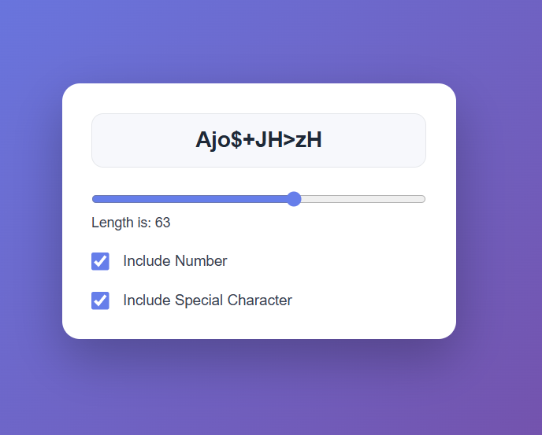

## Closure property
A closure gives a function access to its outer scope.

In [count,setCount]=useState()
count variable will allocate each time whenever the function rerender but setCount are not it will create a reference and point each time.

* **useCallback()**
It is a React Hook that lets you cache a function definition between re-renders.